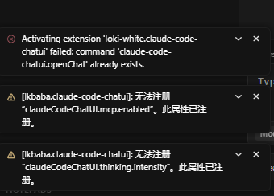
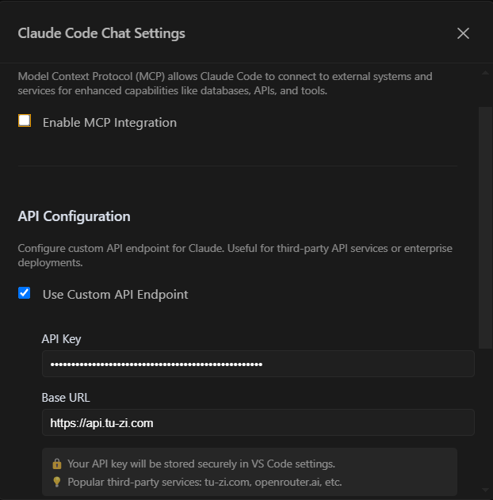

# Claude Code GUI / ChatUI for VS Code

**Claude Code ChatUI** is a full-featured GUI extension for [Claude Code CLI](https://docs.anthropic.com/en/docs/claude-code) in VS Code and Cursor. Works natively on **Windows (no WSL required)** and **macOS**. Supports both official Anthropic accounts and **third-party API providers** with GUI configuration. Key features: **MCP plugin management**, **Skills system**, **Hooks system**, **real-time token & cost tracking**, AI Assistant integration (Gemini + Grok), and multi-language UI (English, 简体中文, 繁體中文). Actively maintained with 236+ commits.

<div align="center">
  

  <!-- Badges -->
  <a href="https://marketplace.visualstudio.com/items?itemName=lkbaba.claude-code-chatui"></a> <a href="https://github.com/LKbaba/Claude-code-ChatInWindows"></a> <a href="https://code.visualstudio.com/"></a> <a href="LICENSE"></a> <a href="https://www.microsoft.com/windows"></a> <a href="https://www.apple.com/macos/"></a> <a href="https://cursor.sh/"></a>
</div>

**🌐 Languages: English | [简体中文](./README.zh-CN.md) | [繁體中文](./README.zh-TW.md)**

---

## Why This Extension?

| Feature | Official Claude Code | Claude Code GUI (MaheshKok) | Claude Code UI (AuraTech) | **This Project** |
|---------|---------------------|---------------------------|--------------------------|-----------------|
| Windows No WSL | ❌ Requires setup | ❌ Requires CLI config | WSL path mapping | ✅ **Native** |
| Third-party API GUI Config | ❌ | ❌ | ❌ | ✅ **Exclusive** |
| MCP Plugin GUI Management | CLI-level only | ✅ MCP Hub | ✅ MCP commands | ✅ GUI config (Global + Workspace) |
| Skills System GUI | CLI-level only | ❌ | ❌ | ✅ **Exclusive** |
| Hooks System GUI | CLI-level only | ❌ | ❌ | ✅ **Exclusive** |
| AI Assistant Integration | ❌ | ❌ | ❌ | ✅ Gemini + Grok |
| Real-time Token Tracking | ❌ | ✅ Usage meter | ✅ Cost tracking | ✅ |
| macOS Support | ✅ | ✅ | ✅ | ✅ |
| npm + Native Installer | ✅ | ✅ | ✅ | ✅ |
| Actively Maintained | ✅ | ✅ | ✅ | ✅ (236+ commits) |

---

## 📸 Preview

[](docs/assets/ui.png)

## 📅 Recent Updates

| Version | Date | Highlights |
|---------|------|------------|
| **v4.1.0** | 2026-04-16 | Opus 4.7 model support; xHigh thinking intensity; /ultrareview command; Compute Mode restore bug fix |
| **v4.0.10** | 2026-04-13 | Cursor history crash fix; history panel XSS fix |
| **v4.0.9** | 2026-04-02 | Project metadata & README rewrite for AI search discoverability |
| **v4.0.8** | 2026-04-02 | Codex MCP template, CLAUDE.md conditional injection |
| **v4.0.7** | 2026-04-02 | Stream parser upgrade: 6 bug fixes, new CLI message types |
| **v4.0.5** | 2026-03-30 | AI Assistant Panel: Grok + Vertex AI support; macOS scroll fix |
| **v4.0.2** | 2026-03-28 | Hooks GUI management panel with 26 event types, 4 hook types, 5 templates |
| **v3.1.9** | 2026-03-29 | CSP security policy, XSS fixes, Windows orphan process cleanup |
| **v3.1.8** | 2026-03-12 | Grok MCP template, default model → Sonnet 4.6, cost bubble dedup |
| **v3.1.7** | 2026-02-18 | Claude Sonnet 4.6 model support, Compute Mode upgrade |
| **v3.1.4** | 2026-01-29 | macOS platform support added |
| **v3.1.0** | 2026-01-13 | Skills panel: copy, enable/disable toggle, plugin protection |
| **v2.1.0** | — | MCP integration, HTTP/SSE transport, server templates |
| **v2.0.0** | — | Complete UI redesign, statistics dashboard, custom API endpoint |

See [CHANGELOG.md](./CHANGELOG.md) for full details.

## 🚀 Quick Start

### Step 1: Environment Setup

1. Install [Git for Windows](https://git-scm.com/) (includes Git Bash)
2. Install [Node.js](https://nodejs.org/) (LTS version recommended, ≥ 18)
3. Open PowerShell as **Administrator** and set environment variable:

```powershell
setx SHELL "C:\Program Files\Git\bin\bash.exe"
```

4. **Restart your computer** (required for changes to take effect)

---

### Step 2: Install Claude Code CLI

After restarting, open a new terminal window:

```powershell
npm install -g @anthropic-ai/claude-code
```

---

> ⚠️ **VPN Users**: Please ensure **TUN mode** is enabled throughout the installation and usage process, otherwise you may not be able to connect to Claude services.

### Step 3: Log in to Claude Code

#### Using Official Account

```powershell
claude
```

A browser window will open for authorization. Log in and copy the token back to the terminal.

#### Using 🔑 Third-Party API

If you're using a third-party API, configure it in the extension:

1. Press `Ctrl+Shift+C` to open the chat interface
2. Click the settings button ⚙️ in the top right corner
3. Check **"Use Custom API Endpoint"**
4. Enter your API key in the **API Key** field (e.g., `sk-ant-xxxxxxxxxx`)
5. Enter the API address in the **Base URL** field (e.g., `https://v3.codesome.cn`)
6. Settings are saved automatically. "Settings updated successfully" confirms the configuration

[](docs/assets/api.png)

**Switch back to official account**: Uncheck "Use Custom API Endpoint".

> 💡 **Tips**:
>
> - If the API key is incorrect, chat will show "processing" until timeout
> - You can switch between official account and third-party API anytime via the toggle

---

> 💡 This extension supports various third-party API services (e.g., [v3.codesome.cn](https://v3.codesome.cn), [openrouter.ai](https://openrouter.ai)). Please consult your API provider for the specific URL.

---

### Step 4: Install the Extension

#### ✨ Method 1: VS Code Marketplace (Recommended)

1. Open VS Code or Cursor
2. Press `Ctrl+Shift+X` to open Extensions
3. Search for `Claude-Code ChatUI` or `lkbaba`
4. Click **Install**

**Direct Link:** [**➡️ VS Code Marketplace**](https://marketplace.visualstudio.com/items?itemName=lkbaba.claude-code-chatui)

#### 📦 Method 2: GitHub Release Download

1. [**🔗 Go to Releases page**](https://github.com/LKbaba/Claude-code-ChatInWindows/releases/latest)
2. Download the `.vsix` file
3. In VS Code, press `Ctrl+Shift+P`, select **"Extensions: Install from VSIX..."**

#### 🛠️ Method 3: Build from Source

```powershell
git clone https://github.com/LKbaba/Claude-code-ChatInWindows.git
cd Claude-code-ChatInWindows
npm install
npm run package
# The generated .vsix file is in the project root, install using Method 2
```

---

### Step 5: Start Using

- **Open Chat Interface**: Press `Ctrl+Shift+C`
- **File Explorer Icon**: Click the icon next to the new folder button

## ❓ FAQ

<details>
<summary><strong>Q: Getting "No suitable shell found" error?</strong></summary>

1. Make sure Git for Windows is installed
2. Run as administrator: `setx SHELL "C:\Program Files\Git\bin\bash.exe"`
3. **Restart your computer** (required for changes to take effect)

If the problem persists, try:

1. Open system environment variables (Win + X → System → Advanced system settings → Environment Variables)
2. Ensure PATH contains `C:\Program Files\Git\cmd`
3. Restart your computer

</details>

<details>
<summary><strong>Q: Third-party API configured but chat not responding?</strong></summary>

Claude Code CLI sometimes needs to be initialized in the command line first. Run in PowerShell:

```powershell
Set-ExecutionPolicy -Scope Process -ExecutionPolicy Bypass -Force
$Env:ANTHROPIC_API_KEY  = "sk-xxxxxxxxxxxxxxxxxxxxxxxx"
$Env:ANTHROPIC_BASE_URL = "https://v3.codesome.cn"
claude
```

If the problem persists, try updating Claude Code CLI:

```powershell
npm install -g @anthropic-ai/claude-code@latest
```

</details>

<details>
<summary><strong>Q: Third-party API stops working after computer restart?</strong></summary>

Environment variables `$Env:ANTHROPIC_API_KEY` and `$Env:ANTHROPIC_BASE_URL` are temporary and will be lost after restart.

Two solutions:

**Option 1**: Reset after each restart

```powershell
$Env:ANTHROPIC_API_KEY  = "your API Key"
$Env:ANTHROPIC_BASE_URL = "https://v3.codesome.cn"
claude
```

**Option 2**: Set as permanent environment variables (run as administrator)

```powershell
setx ANTHROPIC_API_KEY "your API Key"
setx ANTHROPIC_BASE_URL "https://v3.codesome.cn"
# Restart computer for changes to take effect
```

</details>

<details>
<summary><strong>Q: Getting "rg: command not found" error?</strong></summary>

This is optional and doesn't affect normal usage. If you want to install ripgrep for better search performance:

```bash
# In Git Bash:
curl -L https://github.com/BurntSushi/ripgrep/releases/download/14.1.0/ripgrep-14.1.0-x86_64-pc-windows-msvc.zip -o ripgrep.zip
unzip ripgrep.zip && mkdir -p ~/bin
cp ripgrep-14.1.0-x86_64-pc-windows-msvc/rg.exe ~/bin/
echo 'alias rg="~/bin/rg"' >> ~/.bashrc && source ~/.bashrc
```

Note: The extension's built-in Grep tool works fine without ripgrep.

</details>

<details>
<summary><strong>Q: Getting "File has been unexpectedly modified" error when Claude edits files?</strong></summary>

This error occurs when VS Code/Cursor's **auto-save** feature modifies files between Claude's Read and Edit operations.

**Solution: Disable auto-save**

Add this to your VS Code/Cursor settings (`settings.json`):

```json
"files.autoSave": "off"
```

Or use a less aggressive option:

```json
"files.autoSave": "onWindowChange"
```

**Why this happens:**

1. Claude reads a file and stores its content hash
2. Auto-save triggers and modifies the file on disk
3. Claude tries to edit the file, but the hash no longer matches
4. Claude reports "File has been unexpectedly modified"

**Other settings that can cause this issue:**

- `editor.formatOnSave: true` - Formatters modify file content on save
- `files.trimTrailingWhitespace: true` - Removes trailing spaces on save
- `files.insertFinalNewline: true` - Adds newline at end of file

If you need these features, consider disabling them temporarily when using Claude Code.

</details>

---

## 🤝 How to Contribute

1. Fork the project and create a feature branch
2. Focus on a single new feature or improvement
3. Test thoroughly on a real Windows environment
4. Submit a Pull Request with clear description

Welcome all AI engineers, developers, and geeks on Windows!

---

## 📝 License

This project is licensed under the **MIT License**. See [LICENSE](LICENSE) for details.

---

## 🙏 Acknowledgments

- **andrepimenta** – Original project [claude-code-chat](https://github.com/andrepimenta/claude-code-chat)
- **Mrasxieyang (linux.do community)** – Provided the core solution for native Windows installation
- **Anthropic** – For creating the powerful Claude and Claude Code
- **All developers contributing to the Claude Code ecosystem ❤️**
