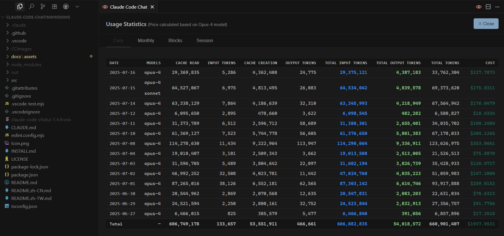

# Claude Code Chat UI – 纯 Windows 专用版

> **Windows 原生 GUI，让 Claude Code 一秒变好用！🚀**

<div align="center">
  

  <!-- Badges -->
  <a href="https://code.visualstudio.com/"></a> <a href="LICENSE"></a> <a href="https://www.microsoft.com/windows"></a> <a href="https://cursor.sh/"></a> <a href="https://github.com/andrepimenta/claude-code-chat"></a>
</div>

**🌐 语言: [English](./README.md) | 🇨🇳 简体中文 | [繁體中文](./README.zh-TW.md)**

---

## 🚩 为什么你需要这个项目？

*   **不用再折腾 WSL**：
    Claude Code 终于支持 **100% Windows 原生运行**，省心到底！
*   **告别路径错误**：
    `C:\` 与 `/usr/` 路径自动无缝转换，避免浪费宝贵的 AI Token。
*   **拒绝终端操作**：
    完整 GUI 聊天界面，复制粘贴、拖拽图片一气呵成，再也不切窗口！

---

## 📸 功能一览

| 聊天主界面                      | Token 实时统计                          | 模块化指令（MCP）                  |
| -------------------------- | ----------------------------------- | --------------------------- |
|  |  |  |

> *将你自己的截图命名并放入 `docs/assets` 即可。*

---

## 🎯 核心优势

*   ✅ **零 WSL 依赖**：只用 Git Bash 和 Node 就能运行。
*   ✅ **快捷键秒开面板**：`Ctrl+Shift+C` 一键呼出，随时随地。
*   ✅ **实时费用统计**：Token 和费用实时显示，明明白白消费。
*   ✅ **Windows 路径兼容**：自动识别路径，无痛跨系统交流。
*   ✅ **MCP 模块化扩展**：一键调用外部工具，让你的 Claude Code 无所不能。
*   ✅ **细节控最爱**：高 DPI 图标、动态主题支持、流畅动画交互。
*   ✅ **「氛围编程」绝配**：全程 GUI，营造极致舒适的编程环境。

---

## 🚀 三分钟安装教程（Windows 原生）

> 只需操作一次，永久免费受益。核心步骤解决了 Windows 环境下 `No suitable shell found` 的报错问题。

### 🔹 第 1 步：环境准备

```powershell
# 1. 安装 Git for Windows（自带 Git Bash，务必安装）
# 下载地址：https://git-scm.com/

# 2. 安装 Node.js（推荐 LTS 版本，≥ 18）
# 下载地址：https://nodejs.org/

# 3. 以【管理员权限】打开 PowerShell 或 CMD，执行以下命令配置环境变量
#    （这会告诉 npm 忽略脚本检查并指定 Git Bash 作为 shell，解决核心报错）
setx NPM_CONFIG_IGNORE_SCRIPTS true
setx SHELL "C:\Program Files\Git\bin\bash.exe"
#    注意：如果你的 Git 安装在其他路径，请相应修改 "C:\Program Files\Git\bin\bash.exe"

# 4.【重要】完全关闭并重启你的 PowerShell/CMD 窗口，让环境变量生效
```

### 🔹 第 2 步：安装并验证 Claude Code CLI

```powershell
# 1. 在【新的】终端窗口中，全局安装 Claude Code CLI
npm install -g @anthropic-ai/claude-code

# 2. 确保 npm 全局路径已添加到系统环境变量 Path 中
#    默认路径通常是: C:\Users\你的用户名\AppData\Roaming\npm
#    如果不确定，可以手动添加到系统环境变量的 "Path" 中

# 3. 首次登录 Claude Code
claude login
#    浏览器将打开授权页面 → 登录后复制页面上的 Token → 粘贴回终端

# 4. 快速验证安装是否成功
claude chat -m sonnet -p "hello"
#    如果看到 Claude 的回复，说明你的环境已准备就绪！
```

---

## 🔌 安装 Claude Code Chat UI 插件

```powershell
# 克隆项目到本地
git clone https://github.com/LKbaba/Claude-code-ChatInWindows.git
cd Claude-code-ChatInWindows
npm install  # 安装依赖

# 在 VS Code 或 Cursor 中运行调试
npm run watch     # 或直接按 F5
```

### 🎉 开始使用

*   **打开聊天界面**：按快捷键 `Ctrl+Shift+C`
*   **个性化配置**：VS Code/Cursor 设置 → 搜索 `claudeCodeChatUI`

**配置示例：**

```jsonc
{
  // Claude 思考强度：think | think-hard | think-harder | ultrathink
  "claudeCodeChatUI.thinking.intensity": "think-harder",

  // Git Bash 路径（默认自动检测，一般无需修改）
  "claudeCodeChatUI.windows.gitBashPath": "C:\\Program Files\\Git\\bin\\bash.exe",

  // MCP 模块化扩展
  "claudeCodeChatUI.mcp.enabled": true,
  "claudeCodeChatUI.mcp.servers": ["http://localhost:7070"]
}
```

---

## 🤝 如何参与贡献

1.  Fork 本项目，创建独立分支
2.  明确聚焦一个新功能或痛点优化
3.  在真实 Windows 环境充分测试
4.  提交前运行 `npm test`（如有测试脚本）
5.  发起 Pull Request，描述清晰易懂，配图更佳。

欢迎所有 Windows 上的 AI 工程师、开发者、极客、氛围编程者加入进来！

---

## 📝 开源许可证

本项目基于 **MIT 协议** 开源，与上游一致。详见 [LICENSE](LICENSE)。

---

## 🙏 致谢与灵感来源

特别感谢：

*   **andrepimenta** – 原始项目 [claude-code-chat](https://github.com/andrepimenta/claude-code-chat)
*   **CCUsage** – Token 实时统计思路启发
*   **Mrasxieyang (linux.do 社区)** – 提供了 Windows 原生安装的核心问题解决方案
*   **Anthropic** – 创造出强大的 Claude 与 Claude Code
*   **所有为 Windows AI 应用生态添砖加瓦的开发者们 ❤️**

---

<div align="center">
⭐ 如果你喜欢本项目，请给颗星支持一下！<br>
Made by vibe‑coding Windows user,<br>
for vibe‑coding Windows users.
</div>
