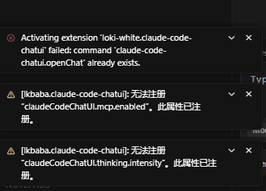
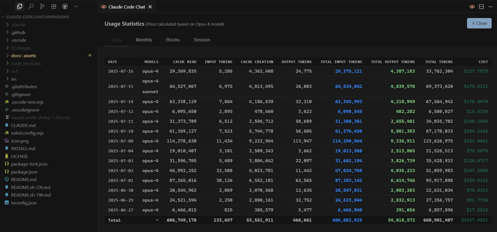
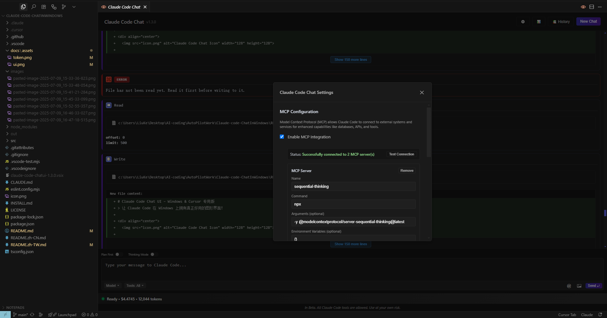
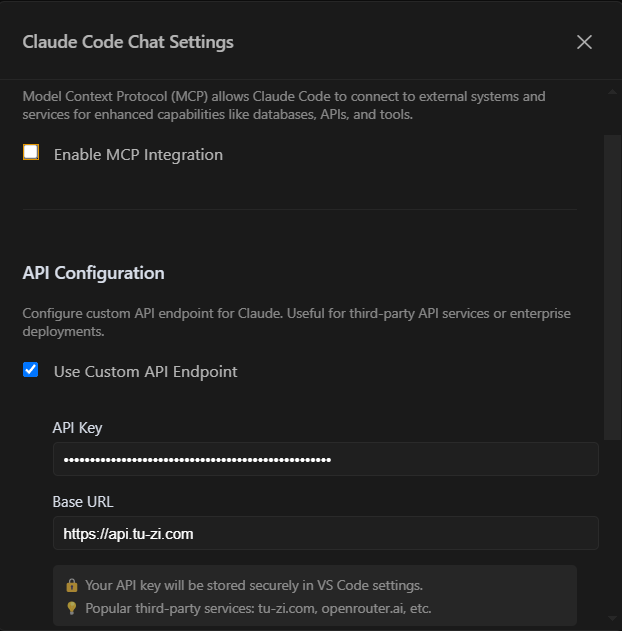

# Claude Code Chat UI – Windows(No WSL)

> **Windows 上的 UI 介面，讓 Claude Code 一秒變好用！🚀**

<div align="center">
  

  <!-- Badges -->
  <a href="https://code.visualstudio.com/"></a> <a href="LICENSE"></a> <a href="https://www.microsoft.com/windows"></a> <a href="https://cursor.sh/"></a> <a href="https://github.com/andrepimenta/claude-code-chat"></a>
</div>

**🌐 語言: [English](./README.md) | [简体中文](./README.zh-CN.md) | 繁體中文**

---

## 🚩 為什麼您需要這個專案？

* **不必再折騰 WSL**：
    Claude Code 終於支援 **100% Windows 原生執行**，省心到底！
* **告別路徑錯誤**：
    `C:\` 與 `/usr/` 路徑自動無縫轉換，避免浪費時間和token。
* **拒絕終端機操作**：
    完整 GUI 聊天介面，複製貼上、插入圖片一氣呵成，再也不切窗口！

---

## 📸 功能一覽

### **聊天主介面**

[](docs/assets/ui.png)

### **Token 即時統計**

[](docs/assets/token.png)

### **模組化指令 (MCP)**

[](docs/assets/mcp.png)

---

## 🎯 核心優勢

* ✅ **零 WSL 依賴**：只需 Git Bash 和 Node 就能執行。
* ✅ **即時費用統計**：Token 和費用即時顯示，清清楚楚消費。
* ✅ **Windows 路徑相容**：自動識別路徑，無痛跨系統交流。
* ✅ **智慧撤銷重做**：支援檔案操作的撤銷/重做，智慧處理依賴關係，自動備份保障資料安全。
* ✅ **MCP 模組化擴充**：一鍵調用外部MCP，內置模板，讓您的 Claude Code 無所不能。
* ✅ **細節控最愛**：高 DPI 圖示、動態主題支援、流暢動畫互動。
* ✅ **「氛圍編程」絕配**：全程 GUI，營造極致舒適的編程環境。

---

## 🚀 安裝與使用

> **🎉 已上架 VS Code 擴充套件市場！** 一鍵安裝，無需複雜設定。
>
> 本部分包含**環境準備**、**擴充套件安裝**與**打包方法**三部分。

> ⚡ **Claude Code v1.0.51+ 使用者注意**：
>
> * 請確保系統PATH中沒有`Git\bin`路徑，否則會遇到啟動錯誤
> * 修改系統環境變數後必須**重啟電腦**才能生效
> * 詳見[環境準備](#-第-1-步環境準備僅需一次)部分

### 🔹 第 1 步：環境準備（僅需一次）

核心步驟解決了 Windows 環境下 `No suitable shell found` 的錯誤訊息問題。

```powershell
# 1. 安裝 Git for Windows（內建 Git Bash，務必安裝）
# 下載位址：https://git-scm.com/

# 2. 安裝 Node.js（推薦 LTS 版本，≥ 18）
# 下載位址：https://nodejs.org/

# 3. 以【管理員權限】打開 PowerShell 或 CMD，執行以下命令配置環境變數

setx NPM_CONFIG_IGNORE_SCRIPTS true

# ⚠️ Claude Code 版本差異：
# - v1.0.50 及以下：需要設定 SHELL 環境變數
setx SHELL "C:\Program Files\Git\bin\bash.exe"
# 注意：如果你的 Git 安裝在其他路徑，請相應修改 "C:\Program Files\Git\bin\bash.exe"

# 4. ⚠️ 重要：修改系統環境變數後必須【重啟電腦】才能完全生效！
# 僅關閉PowerShell/CMD窗口是不夠的

# 5. 重啟電腦後，驗證環境配置
```

### 🔹 第 2 步：安裝並驗證 Claude Code CLI

```powershell
# 1. 在【新的】終端窗口中，全局安裝 Claude Code CLI，推薦 1.0.48
npm install -g @anthropic-ai/claude-code@1.0.48

# ⚠️ 如果遇到 PowerShell 腳本執行策略錯誤，請使用以下方法解決：
# 錯誤示例：「無法加載文件 npm.ps1，因為在此系統上禁止運行腳本」
# 解決方案：臨時放寬當前會話的執行策略（安全性更好）

Set-ExecutionPolicy -Scope Process -ExecutionPolicy Bypass -Force

# 或者直接使用 CMD 代替 PowerShell 來運行 npm 命令

# 2. 確保 npm 全局路徑已添加到系統環境變數 Path 中
# 默認路徑通常是: C:\Users\你的用戶名\AppData\Roaming\npm
# 如果不確定，可以手動添加到系統環境變數的 "Path" 中

# 3. 首次登入 Claude Code（如果使用官方帳號）

claude code

#    瀏覽器將開啟授權頁面 → 登入後複製頁面上的 Token → 貼回終端機
#    💡 提示：如果您計劃使用第三方 API，請往下觀看API操作示例。

# 4. 快速驗證安裝是否成功

claude chat -m sonnet -p "hello"

#    如果看到 Claude 的回覆，說明您的環境已準備就緒！
```

**版本差異說明：**

* Claude Code v1.0.51 增加了Windows原生支援，要求PATH中只有Git\cmd
* Claude Code v1.0.48 將 shell 快照位置從 `/tmp` 改為 `~/.claude`

### 🔹 第 3 步：安裝本擴充套件

#### ✨ 方式一：從 VS Code Marketplace 安裝（推薦）

**擴充套件已正式上架 VS Code 市場！** 🎉

**快速安裝：**

1. 開啟 VS Code 或 Cursor
2. 按 `Ctrl+Shift+X` 開啟擴充套件面板
3. 搜尋 `Claude-Code ChatUI` 或 `lkbaba`
4. 點擊 **安裝**

**直達連結：** [**➡️ 從 VS Code 市場安裝**](https://marketplace.visualstudio.com/items?itemName=lkbaba.claude-code-chatui)

---

#### 📦 方式二：從 GitHub Release 下載安裝（離線安裝）

如果您無法存取 VS Code 市場，可以直接下載已打包好的擴充套件檔案：

1. **[🔗 前往 Releases 頁面](https://github.com/LKbaba/Claude-code-ChatInWindows/releases/latest)** 下載最新版本
2. 下載 `claude-code-chatinwindows-1.x.x.zip` 壓縮包
3. 解壓縮後找到 `claude-code-chatinwindows-x.x.vsix` 檔案
4. 在 VS Code/Cursor 中按 `Ctrl+Shift+P`，選擇 **「擴充功能: 從 VSIX 安裝...」**
5. 選擇解壓縮出的 `.vsix` 檔案完成安裝

> **💡 提示**：這種方式適合網路受限或需要離線安裝的使用者。

---

#### 方式三：高級安裝選項（適合開發者）

如果您想從原始碼執行或手動打包，可以參考以下步驟。

##### 從原始碼執行

```powershell
# 複製專案到本機
git clone https://github.com/LKbaba/Claude-code-ChatInWindows.git
cd Claude-code-ChatInWindows
npm install  # 安裝依賴

# 在 VS Code 或 Cursor 中按 F5 即可進入偵錯模式
```

##### 打包為 VSIX 並安裝

```powershell
# 1. 確保您已在專案根目錄，並已執行 npm install

# 2. 編譯並打包擴充套件
npm run package

#    此命令會自動編譯並打包成一個 .vsix 檔案
```

**如何安裝 `.vsix` 檔案：**

1.  在 VS Code 或 Cursor 中，按下 `Ctrl+Shift+P` 開啟命令面板。
2.  輸入 `Install from VSIX` 並選擇 **"擴展: 從 VSIX 安裝..."**。
3.  選擇專案根目錄下產生的 `.vsix` 檔案進行安裝。

---

### 🎉 開始使用

> **💡 重要提示**：如果您使用 VPN，請確保開啟 **TUN 模式**，否則可能導致 Claude Code 無法正常連接。

* **開啟聊天介面**：按快捷鍵 `Ctrl+Shift+C`
* **新建資料夾右邊**：有一個圖標，點擊即可

### 🔑 使用第三方 API

本擴充套件支援使用第三方 API 服務（如 tu-zi.com、openrouter.ai 等），使用範例如下：

#### 使用步驟

A.擴充套件內設定

1. **開啟設定**：點擊聊天介面的設定按鈕 ⚙️
2. **啟用自訂 API**：勾選 "Use Custom API Endpoint"
3. **設定 API**：
   * **API Key**: 輸入您的 API 金鑰（如 `sk-ant-xxxxxxxxxx`）
   * **Base URL**: 輸入 API 位址（如 `https://api.tu-zi.com`）
4. **儲存確認**：設定會自動儲存，左下角會提示"Settings updated successfully"

[](docs/assets/api.png)

5. **首次初始化**（重要）

> ⚠️ **注意**：首次使用自訂 API 必須先在命令列初始化一次，之後就可以在擴充套件中正常使用了。

B.首次初始化操作

**Windows PowerShell 使用者：**

```powershell
# 開啟一個新的 PowerShell 工作階段
Set-ExecutionPolicy -Scope Process -ExecutionPolicy Bypass -Force   # 跳過指令碼限制

$Env:ANTHROPIC_API_KEY  = "sk-xxxxxxxxxxxxxxxxxxxxxxxx"   # 填寫自己的API-KEY,注意引號需要填入。
$Env:ANTHROPIC_BASE_URL = "https://api.tu-zi.com"         #具體URL需要諮詢api供應商，注意引號需要填入。

claude code # 現在執行 CLI，就能讀到這兩個環境變數

按照提示完成確認，確保第三方api可以傳回訊息。

claude chat -m opus "hello"  # 測試是否設定成功
```

> 💡 **使用提示**：
>
> * **重要**：電腦關機重啟以後需要重新執行初始化💡
> * 使用第三方 API 服務通常價格更實惠，適合預算有限的用戶，常見的第三方服務：[api.tu-zi.com](https://api.tu-zi.com/)、[openrouter.ai](https://openrouter.ai) 、[anyrouter.top](https://anyrouter.top)等
> * 可以透過設定開關隨時切換官方帳號和自訂 API
> * 如果 API 金鑰錯誤，聊天會一直顯示 "processing" 直到逾時
> * 兔子API提供Claude Code月卡，詳見[store.tu-zi.com](https://store.tu-zi.com/)

### ❓ 常見問題

**Q: 升級到 Claude Code v1.0.51 後出現 "No suitable shell found" 錯誤？**

* A: Claude Code v1.0.51 的 Windows 原生支援需要特定的環境配置：
  1. 打開系統環境變數設定（Win + X → 系統 → 進階系統設定 → 環境變數）
  2. 編輯PATH變數，移除所有包含 `Git\bin` 的條目
  3. 確保PATH中有 `C:\Program Files\Git\cmd`
  4. **重要：修改後必須重啟電腦才能生效**
  
  臨時測試方法（PowerShell，無需重啟）：

  ```powershell
  # 臨時移除 Git\bin（僅當前工作階段有效）
  $env:PATH = $env:PATH -replace 'C:\\Program Files\\Git\\bin;?', ''
  claude --version
  claude code
  ```
  
  如果臨時測試成功，請按上述步驟永久修改環境變數並重啟電腦。

**Q: 為什麼設定了 API 但是聊天沒有回應？**

* A: 首次使用自訂 API 需要在命令列初始化執行，確保可以傳回訊息。

**Q: 如何切換回官方帳號？**

* A: 在設定中取消勾選 "Use Custom API Endpoint" 即可

**Q: 遇到 "rg: command not found" 錯誤？**
* A: 這是可選的。如果想安裝 ripgrep 以獲得更好的搜尋效能：
  ```bash
  # 在 Git Bash 中：
  curl -L https://github.com/BurntSushi/ripgrep/releases/download/14.1.0/ripgrep-14.1.0-x86_64-pc-windows-msvc.zip -o ripgrep.zip
  unzip ripgrep.zip && mkdir -p ~/bin
  cp ripgrep-14.1.0-x86_64-pc-windows-msvc/rg.exe ~/bin/
  echo 'alias rg="~/bin/rg"' >> ~/.bashrc && source ~/.bashrc
  ```
  * 注意：擴充套件內建的 Grep 工具即使沒有 ripgrep 也能正常運作。

---

## 🤝 如何參與貢獻

1. Fork 本專案，建立獨立分支
2. 明確聚焦一個新功能或痛點優化
3. 在真實 Windows 環境充分測試
4. 提交前執行 `npm test`（若有測試腳本）
5. 發起 Pull Request，描述清晰易懂，配圖更佳。

歡迎所有 Windows 上的 AI 工程師、開發者、極客、氛圍編程者加入進來！

---

## 📝 開源授權

本專案基於 **MIT 授權** 開源，與上游一致。詳見 [LICENSE](LICENSE)。

---

## 🙏 致謝與靈感來源

特別感謝：

* **andrepimenta** – 原始專案 [claude-code-chat](https://github.com/andrepimenta/claude-code-chat)
* **CCUsage** – Token 即時統計思路啟發
* **Mrasxieyang (linux.do 社群)** – 提供了 Windows 原生安裝的核心問題解決方案
* **Anthropic** – 創造出強大的 Claude 與 Claude Code
* **所有為 Claude Code 應用生態添磚加瓦的開發者們 ❤️**

---
