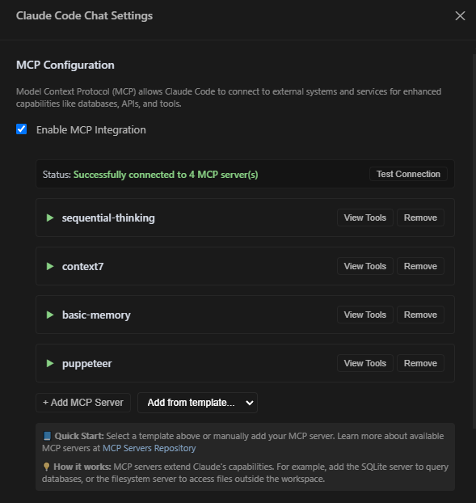

# Claude Code Chat UI – Windows (無 WSL) 專用版

> **Windows 上的 UI 介面，讓 Claude Code 一秒變好用！🚀**

<div align="center">
  

  <!-- Badges -->
  <a href="https://code.visualstudio.com/"></a> <a href="LICENSE"></a> <a href="https://www.microsoft.com/windows"></a> <a href="https://cursor.sh/"></a> <a href="https://github.com/andrepimenta/claude-code-chat"></a>
</div>

**🌐 語言: [English](./README.md) | [简体中文](./README.zh-CN.md) | 繁體中文**

---

## 🚩 為什麼您需要這個專案？

* **不必再折騰 WSL**：
    Claude Code 終於支援 **100% Windows 原生執行**，省心到底！
* **告別路徑錯誤**：
    `C:\` 與 `/usr/` 路徑自動無縫轉換，避免浪費寶貴的 AI Token。
* **拒絕終端機操作**：
    完整 GUI 聊天介面，複製貼上、拖曳圖片一氣呵成，再也不用切換視窗！

---

## 📸 功能一覽

### **聊天主介面**


### **Token 即時統計**


### **模組化指令 (MCP)**



---

## 🎯 核心優勢

* ✅ **零 WSL 依賴**：只需 Git Bash 和 Node 就能執行。
* ✅ **即時費用統計**：Token 和費用即時顯示，清清楚楚消費。
* ✅ **Windows 路徑相容**：自動識別路徑，無痛跨系統交流。
* ✅ **MCP 模組化擴充**：一鍵呼叫外部工具，讓您的 Claude Code 無所不能。
* ✅ **細節控最愛**：高 DPI 圖示、動態主題支援、流暢動畫互動。
* ✅ **「氛圍編程」絕配**：全程 GUI，營造極致舒適的編程環境。

---

## 🚀 安裝與使用

> 本部分包含**環境準備**、**擴充套件安裝**與**打包方法**三部分。

### 🔹 第 1 步：環境準備（僅需一次）

核心步驟解決了 Windows 環境下 `No suitable shell found` 的錯誤訊息問題。

```powershell
# 1. 安裝 Git for Windows（內建 Git Bash，務必安裝）
# 下載位址：https://git-scm.com/

# 2. 安裝 Node.js（推薦 LTS 版本，≥ 18）
# 下載位址：https://nodejs.org/

# 3. 以【系統管理員權限】開啟 PowerShell 或 CMD，執行以下命令設定環境變數
#    （這會告訴 npm 忽略指令碼檢查並指定 Git Bash 作為 shell，解決核心錯誤）
setx NPM_CONFIG_IGNORE_SCRIPTS true
setx SHELL "C:\Program Files\Git\bin\bash.exe"
#    注意：如果您的 Git 安裝在其他路徑，請相應修改 "C:\Program Files\Git\bin\bash.exe"

# 4.【重要】完全關閉並重啟您的 PowerShell/CMD 視窗，讓環境變數生效
```

### 🔹 第 2 步：安裝並驗證 Claude Code CLI

```powershell
# 1. 在【新的】終端機視窗中，全域安裝 Claude Code CLI
npm install -g @anthropic-ai/claude-code

# 2. 確保 npm 全域路徑已新增至系統環境變數 Path 中
#    預設路徑通常是: C:\Users\您的使用者名稱\AppData\Roaming\npm
#    如果不確定，可以手動新增至系統環境變數的 "Path" 中

# 3. 首次登入 Claude Code
claude login
#    瀏覽器將開啟授權頁面 → 登入後複製頁面上的 Token → 貼回終端機

# 4. 快速驗證安裝是否成功
claude chat -m sonnet -p "hello"
#    如果看到 Claude 的回覆，說明您的環境已準備就緒！
```

### 🔹 第 3 步：安裝本擴充套件

#### 方式一：從 VS Code Marketplace 安裝 (最推薦)

1.  開啟 VS Code 或 Cursor。
2.  點擊側邊欄的 **擴充功能** 圖示 (Extensions)。
3.  在搜尋框中輸入 `Claude-Code ChatUI for Windows` 或擴充套件的唯一 ID `lkbaba.claude-code-chatui`。
4.  找到本擴充套件，點擊 **安裝 (Install)**。

您也可以直接造訪 [**➡️ Marketplace 擴充套件主頁**](https://marketplace.visualstudio.com/items?itemName=lkbaba.claude-code-chatui) 點擊安裝。

#### 方式二：進階安裝選項 (適合開發者)

如果您想從原始碼執行或手動打包，可以參考以下步驟。

##### 從原始碼執行

```powershell
# 複製專案到本機
git clone https://github.com/LKbaba/Claude-code-ChatInWindows.git
cd Claude-code-ChatInWindows
npm install  # 安裝依賴

# 在 VS Code 或 Cursor 中按 F5 即可進入偵錯模式
```

##### 打包為 VSIX 並安裝

```powershell
# 1. 確保您已在專案根目錄，並已執行 npm install

# 2. 編譯並打包擴充套件
npm run package

#    此命令會自動編譯並打包成一個 .vsix 檔案
```

**如何安裝 `.vsix` 檔案：**

1.  在 VS Code 或 Cursor 中，按下 `Ctrl+Shift+P` 開啟命令面板。
2.  輸入 `Install from VSIX` 並選擇 **"擴充功能: 從 VSIX 安裝..."**。
3.  選擇專案根目錄下產生的 `.vsix` 檔案進行安裝。

---

### 🎉 開始使用

*   **開啟聊天介面**：按快捷鍵 `Ctrl+Shift+C`
*   **個人化設定**：VS Code/Cursor 設定 → 搜尋 `claudeCodeChatUI`

**設定範例：**

```jsonc
{
  // Claude 思考強度：think | think-hard | think-harder | ultrathink
  "claudeCodeChatUI.thinking.intensity": "think-harder",

  // Git Bash 路徑（預設自動偵測，一般無需修改）
  "claudeCodeChatUI.windows.gitBashPath": "C:\\Program Files\\Git\\bin\\bash.exe",

  // MCP 模組化擴充
  "claudeCodeChatUI.mcp.enabled": true,
  "claudeCodeChatUI.mcp.servers": ["http://localhost:7070"]
}
```

---

## 🤝 如何參與貢獻

1. Fork 本專案，建立獨立分支
2. 明確聚焦一個新功能或痛點優化
3. 在真實 Windows 環境充分測試
4. 提交前執行 `npm test`（若有測試腳本）
5. 發起 Pull Request，描述清晰易懂，配圖更佳。

歡迎所有 Windows 上的 AI 工程師、開發者、極客、氛圍編程者加入進來！

---

## 📝 開源授權

本專案基於 **MIT 授權** 開源，與上游一致。詳見 [LICENSE](LICENSE)。

---

## 🙏 致謝與靈感來源

特別感謝：

* **andrepimenta** – 原始專案 [claude-code-chat](https://github.com/andrepimenta/claude-code-chat)
* **CCUsage** – Token 即時統計思路啟發
* **Mrasxieyang (linux.do 社群)** – 提供了 Windows 原生安裝的核心問題解決方案
* **Anthropic** – 創造出強大的 Claude 與 Claude Code
* **所有為 Claude Code 應用生態添磚加瓦的開發者們 ❤️**

---
