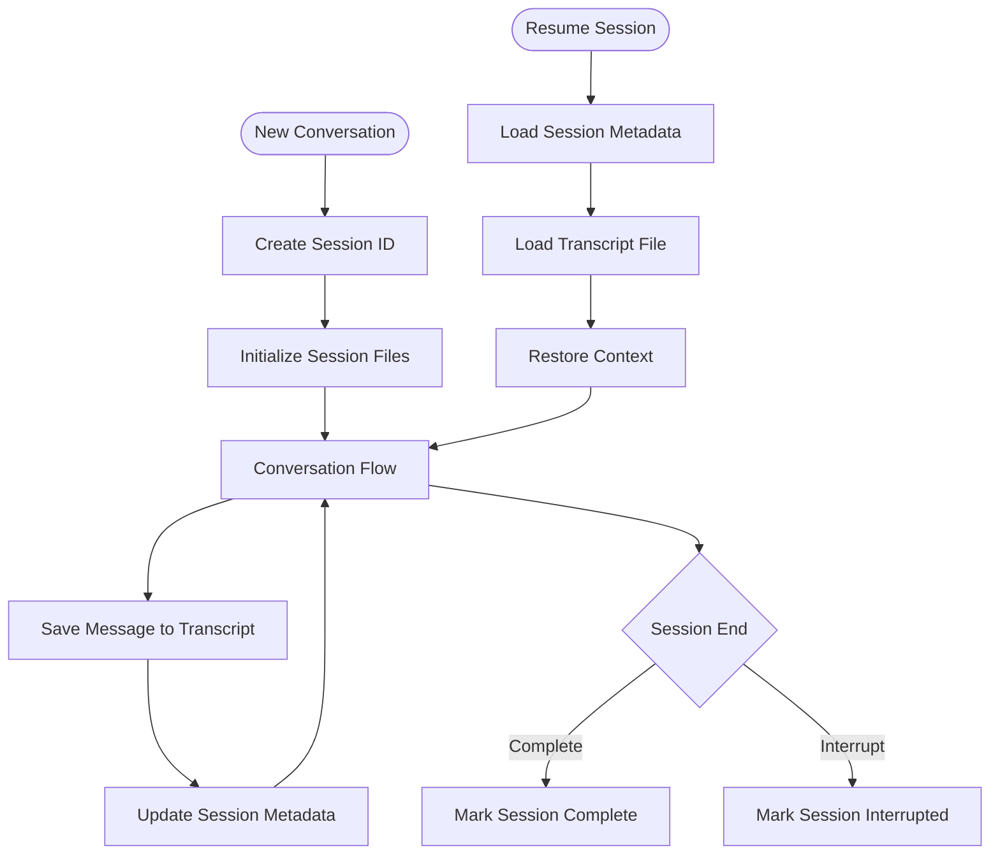

# Session Management

Understanding how the Claude Agent SDK handles sessions, session files, and session resumption

## Session Management

The Claude Agent SDK provides session management capabilities for handling conversation state, persistence, and resumption. This guide covers how sessions are created, managed, persisted to files, and resumed within the SDK.

## Session Architecture

The Claude Agent SDK implements a file-based session management system that handles conversation persistence and state restoration.


```mermaid
flowchart TD
    Start([New Conversation]) --> CreateSession[Create Session ID]
    CreateSession --> InitFiles[Initialize Session Files]
    InitFiles --> Conversation[Conversation Flow]

    Conversation --> SaveMessage[Save Message to Transcript]
    SaveMessage --> UpdateMetadata[Update Session Metadata]
    UpdateMetadata --> Conversation

    Conversation --> End{Session End}
    End -->|Complete| MarkComplete[Mark Session Complete]
    End -->|Interrupt| MarkInterrupted[Mark Session Interrupted]

    Resume([Resume Session]) --> LoadMetadata[Load Session Metadata]
    LoadMetadata --> LoadTranscript[Load Transcript File]
    LoadTranscript --> RestoreContext[Restore Context]
    RestoreContext --> Conversation
```

## Session File Structure

Sessions are persisted to the local filesystem in a structured format:

```
~/.config/claude/
├── sessions/
│   └── sessions.json          # Session metadata and state
└── projects/
    └── {project-hash}/
        └── {session-id}.jsonl # Session transcript
```

## Session Metadata Format

The `sessions.json` file stores metadata about all sessions:

**TypeScript**
```typescript
interface SessionMetadata {
  id: string
  name: string
  status: 'active' | 'completed' | 'interrupted'
  createdAt: Date
  updatedAt: Date
  completedAt?: Date
  projectPath: string
  transcriptPath: string
  metadata: {
    model?: string
    tools?: string[]
    lastMessageId?: string
  }
}
```

**Python**
```python
from typing import Optional, List, Dict, Literal
from datetime import datetime

class SessionMetadata:
    id: str
    name: str
    status: Literal['active', 'completed', 'interrupted']
    created_at: datetime
    updated_at: datetime
    completed_at: Optional[datetime]
    project_path: str
    transcript_path: str
    metadata: Dict[str, any]
```

## Session Transcript Format

Session transcripts are stored as JSONL (JSON Lines) files, with each line representing a message or event:

```json
{"type": "user", "uuid": "abc123", "timestamp": "2024-01-01T10:00:00Z", "message": {"content": "Hello Claude"}}
{"type": "assistant", "uuid": "def456", "parentUuid": "abc123", "timestamp": "2024-01-01T10:00:01Z", "message": {"content": [{"type": "text", "text": "Hello! How can I help?"}]}}
{"type": "checkpoint", "sessionId": "session123", "commit": "a1b2c3d", "timestamp": "2024-01-01T10:00:02Z", "label": "Initial state", "id": "chk456"}
```

Each line in the JSONL file represents:
- **User messages**: Input from the user
- **Assistant messages**: Responses from Claude
- **Checkpoints**: Saved states in the conversation (e.g., after completing a task)
- **Tool use**: Records of when tools were invoked and their results

## Session Lifecycle

### Creation and Initialization

When a session starts, the SDK performs several initialization steps:

1. **Generate Session ID**: Creates a unique identifier for the session
2. **Create Project Directory**: Sets up the project-specific storage location
3. **Initialize Transcript File**: Creates an empty JSONL file for the conversation
4. **Store Initial Metadata**: Records session creation time and configuration

### Getting the Session ID

The session ID is provided in the initial system message when you start a conversation. You can capture it for later use:

**TypeScript**
```typescript
import { query } from "@anthropic-ai/claude-agent-sdk"

let sessionId: string | undefined

const response = query({
  prompt: "Help me build a web application",
  options: {
    model: "claude-sonnet-4-20250514"
  }
})

for await (const message of response) {
  // The first message is a system init message with the session ID
  if (message.type === 'system' && message.subtype === 'init') {
    sessionId = message.session_id
    console.log(`Session started with ID: ${sessionId}`)
    // You can save this ID for later resumption
  }

  // Process other messages...
  console.log(message)
}

// Later, you can use the saved sessionId to resume
if (sessionId) {
  const resumedResponse = query({
    prompt: "Continue where we left off",
    options: {
      resume: sessionId
    }
  })
}
```

**Python**
```python
from claude_agent_sdk import query

session_id = None

response = query(
    prompt="Help me build a web application",
    options={
        "model": "claude-sonnet-4-20250514"
    }
)

async for message in response:
    # The first message is a system init message with the session ID
    if message["type"] == "system" and message.get("subtype") == "init":
        session_id = message["session_id"]
        print(f"Session started with ID: {session_id}")
        # You can save this ID for later resumption

    # Process other messages...
    print(message)

# Later, you can use the saved session_id to resume
if session_id:
    resumed_response = query(
        prompt="Continue where we left off",
        options={
            "resume": session_id
        }
    )
```

### Session State Persistence

The SDK automatically persists session state to disk:

- **After each message exchange**: The transcript is updated
- **On tool invocations**: Tool use and results are recorded
- **At checkpoints**: Important conversation states are marked
- **On session end**: Final state is saved

## Session Resumption

The SDK supports resuming sessions from previous conversation states, enabling continuous development workflows.

### Resume from Session Files

**TypeScript**
```typescript
import { query } from "@anthropic-ai/claude-agent-sdk"

// Resume a previous session using its ID
const response = query({
  prompt: "Continue implementing the authentication system from where we left off",
  options: {
    resume: "session-xyz", // Session ID from previous conversation
    model: "claude-sonnet-4-20250514",
    allowedTools: ["Read", "Edit", "Write", "Glob", "Grep", "Bash"]
  }
})

// The conversation continues with full context from the previous session
for await (const message of response) {
  console.log(message)
}
```

**Python**
```python
from claude_agent_sdk import query

# Resume a previous session using its ID
response = query(
    prompt="Continue implementing the authentication system from where we left off",
    options={
        "resume": "session-xyz",  # Session ID from previous conversation
        "model": "claude-sonnet-4-20250514",
        "allowed_tools": ["Read", "Edit", "Write", "Glob", "Grep", "Bash"]
    }
)

# The conversation continues with full context from the previous session
async for message in response:
    print(message)
```

## Session History API

The SDK exposes a set of read-only functions for querying stored sessions without starting a new conversation. All functions are async and return plain objects.

### `listSessions`

Returns a paginated list of past sessions ordered by most-recently-updated.

| Parameter | Type | Description |
|-----------|------|-------------|
| `limit` | `number` (optional) | Maximum number of sessions to return. Defaults to 20. |
| `offset` | `number` (optional) | Number of sessions to skip. Use with `limit` for pagination. |

**TypeScript**
```typescript
import { listSessions } from "@anthropic-ai/claude-agent-sdk"

// Fetch the 10 most recent sessions
const sessions = await listSessions({ limit: 10, offset: 0 })

for (const session of sessions) {
  console.log(`${session.id}  ${session.name}  (${session.status})`)
}

// Next page
const nextPage = await listSessions({ limit: 10, offset: 10 })
```

**Python**
```python
from claude_agent_sdk import list_sessions

# Fetch the 10 most recent sessions
sessions = await list_sessions(limit=10, offset=0)

for session in sessions:
    print(f"{session['id']}  {session['name']}  ({session['status']})")

# Next page
next_page = await list_sessions(limit=10, offset=10)
```

### `getSessionMessages`

Retrieves the messages stored in a session transcript, with optional pagination for long conversations.

| Parameter | Type | Description |
|-----------|------|-------------|
| `sessionId` | `string` | The session ID to retrieve messages from. |
| `limit` | `number` (optional) | Maximum number of messages to return. |
| `offset` | `number` (optional) | Number of messages to skip from the beginning of the transcript. |

**TypeScript**
```typescript
import { getSessionMessages } from "@anthropic-ai/claude-agent-sdk"

const messages = await getSessionMessages("session-xyz", { limit: 50, offset: 0 })

for (const msg of messages) {
  console.log(`[${msg.type}] ${JSON.stringify(msg.message).slice(0, 80)}`)
}
```

**Python**
```python
from claude_agent_sdk import get_session_messages

messages = await get_session_messages("session-xyz", limit=50, offset=0)

for msg in messages:
    print(f"[{msg['type']}] {str(msg.get('message', ''))[:80]}")
```

### `getSessionInfo`

Returns lightweight metadata for a single session without loading the full transcript.

| Field | Type | Description |
|-------|------|-------------|
| `id` | `string` | Unique session identifier |
| `tag` | `string \| null` | User-assigned tag, or `null` if untagged |
| `createdAt` | `Date` | When the session was first created |

**TypeScript**
```typescript
import { getSessionInfo } from "@anthropic-ai/claude-agent-sdk"

const info = await getSessionInfo("session-xyz")

console.log(`Session: ${info.id}`)
console.log(`Tag:     ${info.tag ?? "(none)"}`)
console.log(`Created: ${info.createdAt.toISOString()}`)
```

**Python**
```python
from claude_agent_sdk import get_session_info

info = await get_session_info("session-xyz")

print(f"Session: {info['id']}")
print(f"Tag:     {info.get('tag') or '(none)'}")
print(f"Created: {info['created_at'].isoformat()}")
```

## Session Mutations

In addition to reading session data, the SDK provides functions to modify session metadata and branch conversation history.

### `renameSession`

Assigns a human-readable name to an existing session, replacing any previous name.

**TypeScript**
```typescript
import { renameSession } from "@anthropic-ai/claude-agent-sdk"

await renameSession("session-xyz", "Auth refactor — March 2025")
console.log("Session renamed.")
```

**Python**
```python
from claude_agent_sdk import rename_session

await rename_session("session-xyz", "Auth refactor — March 2025")
print("Session renamed.")
```

### `tagSession`

Attaches a short tag to a session for grouping or filtering purposes. Pass `null` (TypeScript) or `None` (Python) to clear an existing tag.

**TypeScript**
```typescript
import { tagSession } from "@anthropic-ai/claude-agent-sdk"

// Set a tag
await tagSession("session-xyz", "production")

// Clear the tag
await tagSession("session-xyz", null)
```

**Python**
```python
from claude_agent_sdk import tag_session

# Set a tag
await tag_session("session-xyz", "production")

# Clear the tag
await tag_session("session-xyz", None)
```

### `forkSession`

Creates a new session branched from an existing one at its current state. The forked session contains a full copy of the transcript up to the fork point; subsequent messages in either session do not affect the other.

This is useful for exploring alternative continuations of a conversation without losing the original thread.

**TypeScript**
```typescript
import { forkSession, query } from "@anthropic-ai/claude-agent-sdk"

// Branch the conversation at its current state
const forkedId = await forkSession("session-xyz")
console.log(`Forked session ID: ${forkedId}`)

// Continue the original session unchanged
const original = query({
  prompt: "Keep going with the original approach",
  options: { resume: "session-xyz" }
})

// Explore an alternative in the fork
const fork = query({
  prompt: "Try a completely different implementation strategy",
  options: { resume: forkedId }
})

for await (const msg of fork) {
  console.log(msg)
}
```

**Python**
```python
from claude_agent_sdk import fork_session, query

# Branch the conversation at its current state
forked_id = await fork_session("session-xyz")
print(f"Forked session ID: {forked_id}")

# Continue the original session unchanged
original = query(
    prompt="Keep going with the original approach",
    options={"resume": "session-xyz"}
)

# Explore an alternative in the fork
fork = query(
    prompt="Try a completely different implementation strategy",
    options={"resume": forked_id}
)

async for msg in fork:
    print(msg)
```

## Error Handling and Recovery

### Handling Interrupted Sessions

**TypeScript**
```typescript
import { query } from '@anthropic-ai/claude-agent-sdk'
import { readFile } from 'fs/promises'
import { homedir } from 'os'
import { join } from 'path'

// Check if a session was interrupted
const checkSessionStatus = async (sessionId: string) => {
  const metadataPath = join(homedir(), '.config/claude/sessions/sessions.json')
  const metadata = JSON.parse(await readFile(metadataPath, 'utf-8'))

  const session = metadata.find(s => s.id === sessionId)

  if (session?.status === 'interrupted') {
    console.log('Session was interrupted. Ready for resumption...')
    // The SDK handles loading the transcript internally
    return { canResume: true, sessionId: sessionId }
  }

  return { canResume: false }
}

// Resume an interrupted session
const resumeInterrupted = async (sessionId: string) => {
  const status = await checkSessionStatus(sessionId)

  if (status.canResume) {
    const response = query({
      prompt: "Let's continue from where we left off",
      options: {
        resume: status.sessionId
      }
    })

    for await (const message of response) {
      console.log(message)
    }
  }
}
```

**Python**
```python
from claude_agent_sdk import query
import json
import asyncio
from pathlib import Path

# Check if a session was interrupted
async def check_session_status(session_id: str):
    metadata_path = Path.home() / ".config/claude/sessions/sessions.json"

    with open(metadata_path, 'r') as f:
        metadata = json.load(f)

    session = next((s for s in metadata if s["id"] == session_id), None)

    if session and session.get("status") == "interrupted":
        print("Session was interrupted. Ready for resumption...")
        # The SDK handles loading the transcript internally
        return {"can_resume": True, "session_id": session_id}

    return {"can_resume": False}

# Resume an interrupted session
async def resume_interrupted(session_id: str):
    status = await check_session_status(session_id)

    if status["can_resume"]:
        response = query(
            prompt="Let's continue from where we left off",
            options={
                "resume": status["session_id"]
            }
        )

        async for message in response:
            print(message)
```

The Claude Agent SDK's session management system provides a robust foundation for maintaining conversation state and enabling seamless resumption of development tasks, all through a simple file-based approach that requires no external infrastructure.
