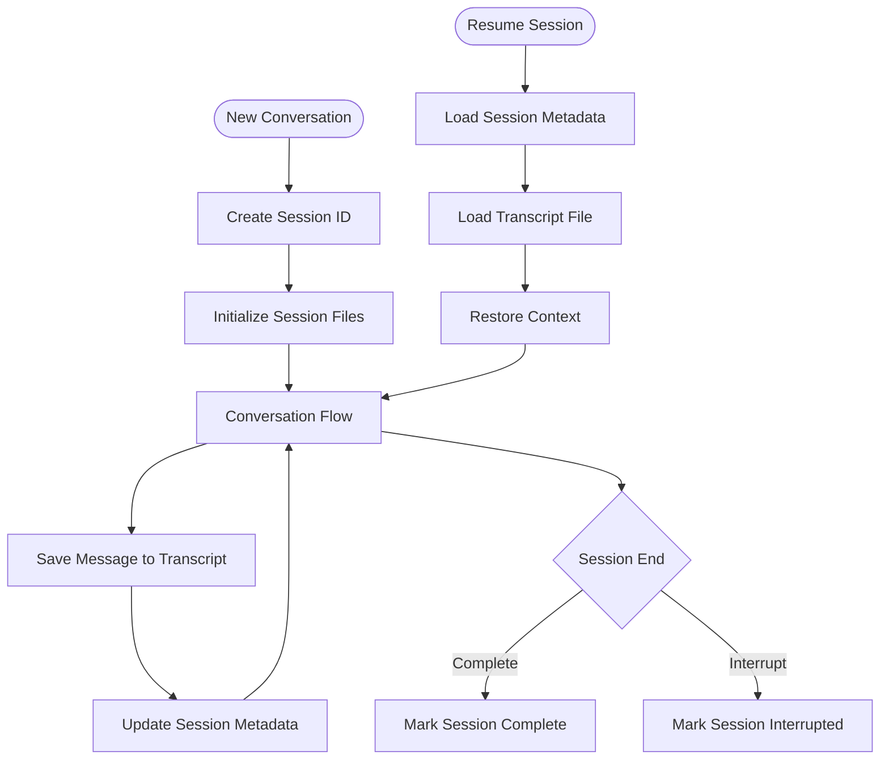

# Session Management

Understanding how the Claude Code SDK handles sessions, session files, and session resumption

## Session Management

The Claude Code SDK provides session management capabilities for handling conversation state, persistence, and resumption. This guide covers how sessions are created, managed, persisted to files, and resumed within the SDK.

## Session Architecture

The Claude Code SDK implements a file-based session management system that handles conversation persistence and state restoration.



## Session File Structure

Sessions are persisted to the local filesystem in a structured format:

```
~/.config/claude/
├── sessions/
│   └── sessions.json          # Session metadata and state
└── projects/
    └── {project-hash}/
        └── {session-id}.jsonl # Session transcript
```

## Session Metadata Format

The `sessions.json` file stores metadata about all sessions:

**TypeScript**
```typescript
interface SessionMetadata {
  id: string
  name: string
  status: 'active' | 'completed' | 'interrupted'
  createdAt: Date
  updatedAt: Date
  completedAt?: Date
  projectPath: string
  transcriptPath: string
  metadata: {
    model?: string
    tools?: string[]
    lastMessageId?: string
  }
}
```

**Python**
```python
from typing import Optional, List, Dict, Literal
from datetime import datetime

class SessionMetadata:
    id: str
    name: str
    status: Literal['active', 'completed', 'interrupted']
    created_at: datetime
    updated_at: datetime
    completed_at: Optional[datetime]
    project_path: str
    transcript_path: str
    metadata: Dict[str, any]
```

## Session Transcript Format

Session transcripts are stored as JSONL (JSON Lines) files, with each line representing a message or event:

```json
{"type": "user", "uuid": "abc123", "timestamp": "2024-01-01T10:00:00Z", "message": {"content": "Hello Claude"}}
{"type": "assistant", "uuid": "def456", "parentUuid": "abc123", "timestamp": "2024-01-01T10:00:01Z", "message": {"content": [{"type": "text", "text": "Hello! How can I help?"}]}}
{"type": "checkpoint", "sessionId": "session123", "commit": "a1b2c3d", "timestamp": "2024-01-01T10:00:02Z", "label": "Initial state", "id": "chk456"}
```

Each line in the JSONL file represents:
- **User messages**: Input from the user
- **Assistant messages**: Responses from Claude
- **Checkpoints**: Saved states in the conversation (e.g., after completing a task)
- **Tool use**: Records of when tools were invoked and their results

## Session Lifecycle

### Creation and Initialization

When a session starts, the SDK performs several initialization steps:

1. **Generate Session ID**: Creates a unique identifier for the session
2. **Create Project Directory**: Sets up the project-specific storage location
3. **Initialize Transcript File**: Creates an empty JSONL file for the conversation
4. **Store Initial Metadata**: Records session creation time and configuration

### Getting the Session ID

The session ID is provided in the initial system message when you start a conversation. You can capture it for later use:

**TypeScript**
```typescript
import { query } from "@anthropic-ai/claude-code"

let sessionId: string | undefined

const response = query({
  prompt: "Help me build a web application",
  options: {
    model: "claude-sonnet-4-20250514"
  }
})

for await (const message of response) {
  // The first message is a system init message with the session ID
  if (message.type === 'system' && message.subtype === 'init') {
    sessionId = message.session_id
    console.log(`Session started with ID: ${sessionId}`)
    // You can save this ID for later resumption
  }
  
  // Process other messages...
  console.log(message)
}

// Later, you can use the saved sessionId to resume
if (sessionId) {
  const resumedResponse = query({
    prompt: "Continue where we left off",
    options: {
      resume: sessionId
    }
  })
}
```

**Python**
```python
from claude_code import query

session_id = None

response = query(
    prompt="Help me build a web application",
    options={
        "model": "claude-sonnet-4-20250514"
    }
)

async for message in response:
    # The first message is a system init message with the session ID
    if message["type"] == "system" and message.get("subtype") == "init":
        session_id = message["session_id"]
        print(f"Session started with ID: {session_id}")
        # You can save this ID for later resumption
    
    # Process other messages...
    print(message)

# Later, you can use the saved session_id to resume
if session_id:
    resumed_response = query(
        prompt="Continue where we left off",
        options={
            "resume": session_id
        }
    )
```

### Session State Persistence

The SDK automatically persists session state to disk:

- **After each message exchange**: The transcript is updated
- **On tool invocations**: Tool use and results are recorded
- **At checkpoints**: Important conversation states are marked
- **On session end**: Final state is saved

## Session Resumption

The SDK supports resuming sessions from previous conversation states, enabling continuous development workflows.

### Resume from Session Files

**TypeScript**
```typescript
import { query } from "@anthropic-ai/claude-code"

// Resume a previous session using its ID
const response = query({
  prompt: "Continue implementing the authentication system from where we left off",
  options: {
    resume: "session-xyz", // Session ID from previous conversation
    model: "claude-sonnet-4-20250514",
    allowedTools: ["Read", "Edit", "Write", "Glob", "Grep", "Bash"]
  }
})

// The conversation continues with full context from the previous session
for await (const message of response) {
  console.log(message)
}
```

**Python**
```python
from claude_code import query

# Resume a previous session using its ID
response = query(
    prompt="Continue implementing the authentication system from where we left off",
    options={
        "resume": "session-xyz",  # Session ID from previous conversation
        "model": "claude-sonnet-4-20250514",
        "allowed_tools": ["Read", "Edit", "Write", "Glob", "Grep", "Bash"]
    }
)

# The conversation continues with full context from the previous session
async for message in response:
    print(message)
```

## Error Handling and Recovery

### Handling Interrupted Sessions

**TypeScript**
```typescript
import { query } from '@anthropic-ai/claude-code'
import { readFile } from 'fs/promises'
import { homedir } from 'os'
import { join } from 'path'

// Check if a session was interrupted
const checkSessionStatus = async (sessionId: string) => {
  const metadataPath = join(homedir(), '.config/claude/sessions/sessions.json')
  const metadata = JSON.parse(await readFile(metadataPath, 'utf-8'))
  
  const session = metadata.find(s => s.id === sessionId)
  
  if (session?.status === 'interrupted') {
    console.log('Session was interrupted. Ready for resumption...')
    // The SDK handles loading the transcript internally
    return { canResume: true, sessionId: sessionId }
  }
  
  return { canResume: false }
}

// Resume an interrupted session
const resumeInterrupted = async (sessionId: string) => {
  const status = await checkSessionStatus(sessionId)
  
  if (status.canResume) {
    const response = query({
      prompt: "Let's continue from where we left off",
      options: {
        resume: status.sessionId
      }
    })
    
    for await (const message of response) {
      console.log(message)
    }
  }
}
```

**Python**
```python
from claude_code import query
import json
import asyncio
from pathlib import Path

# Check if a session was interrupted
async def check_session_status(session_id: str):
    metadata_path = Path.home() / ".config/claude/sessions/sessions.json"
    
    with open(metadata_path, 'r') as f:
        metadata = json.load(f)
    
    session = next((s for s in metadata if s["id"] == session_id), None)
    
    if session and session.get("status") == "interrupted":
        print("Session was interrupted. Ready for resumption...")
        # The SDK handles loading the transcript internally
        return {"can_resume": True, "session_id": session_id}
    
    return {"can_resume": False}

# Resume an interrupted session
async def resume_interrupted(session_id: str):
    status = await check_session_status(session_id)
    
    if status["can_resume"]:
        response = query(
            prompt="Let's continue from where we left off",
            options={
                "resume": status["session_id"]
            }
        )
        
        async for message in response:
            print(message)
```

The Claude Code SDK's session management system provides a robust foundation for maintaining conversation state and enabling seamless resumption of development tasks, all through a simple file-based approach that requires no external infrastructure.